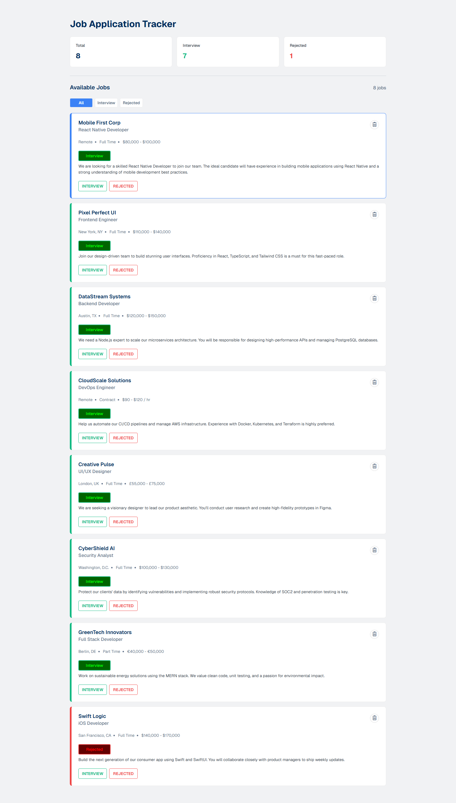

# a4-PH-Job-Tracker

This is an assignment project of MERN stack course in programming hero batch 13.

Live project - https://zunaidchowdhury.github.io/a4-PH-Job-Tracker/

## Answers to Questions

1. What is the difference between getElementById, getElementsByClassName, and querySelector / querySelectorAll?

Answer: All of them are used to get reference of html specific element/elements using dom.
getElementById used to get a element using its id attribute's value.

getElementsByClassName used to get multiple elements using their class name. it returns in HTML Collection, its array like object but not an array. we cant use forEach in it.

querySelector used to get a single html element. the way we target/grab a html element in css file with selector we can query/get a element from dom using querySelector like that.

querySelectorAll - the way we target/grab html elements in css file with selector we can query/get multiple elements from dom using querySelectorAll like that. It returns elements in a NodeList, which is also array like object but we can use forEach with it.

2. How do you create and insert a new element into the DOM?

Answer: first we need to get reference to a html element so we can attach our newly created element to that.
then we can create an element using document.createElement() method.
after that we can add content to it then finally to attach it, we can use appendChild method, we can use prepend also.

for example,
const body = document.querySelector('body');
const parent = document.createElement('div');
parent.innerText = 'Hello World';
body.appendChild(parent);

3. What is Event Bubbling? And how does it work?

Answer: When a user clicks in a button, the browser handles it in 3 phases.

Capturing phase - event travels from root to target element.
Target phase - event reaches target element and calls the listener for that element.
Bubbling phase - event travels back to the top, root of the document from target element. if any parent element has any event listener for that same event, it will also be triggered.

so when an event triggered in a specific element bubbles up through its parent elements in the hierarchy until it reaches the root, that is event bubbling.

4. What is Event Delegation in JavaScript? Why is it useful?
Answer: Event Delegation is a way to handle events from one place like from parent for all childs interactive elements.
Why its useful? Instead of attaching events to every childs interactive elements, we can attach a signle listener to parent and get/handle all events from one place.

its very useful for development, it makes code much cleaner, readable, and most importantly it increases performance, makes use of less memory.

5. What is the difference between preventDefault() and stopPropagation() methods?
Answer: These two methods have totaly different actions.
'preventDefault' is used to prevent browser's built-in behavior for an element, and stopPropagation() stops the event from moving up or down the DOM tree.
preventDefault can be used to prevents a form from refreshing the page on submit.

## Desktop Version

  

